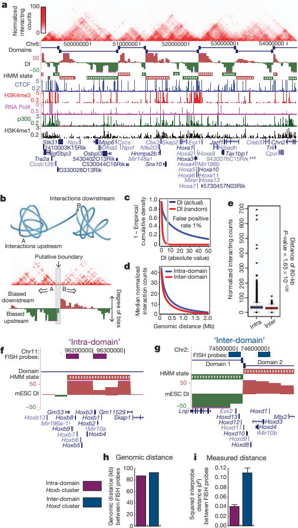
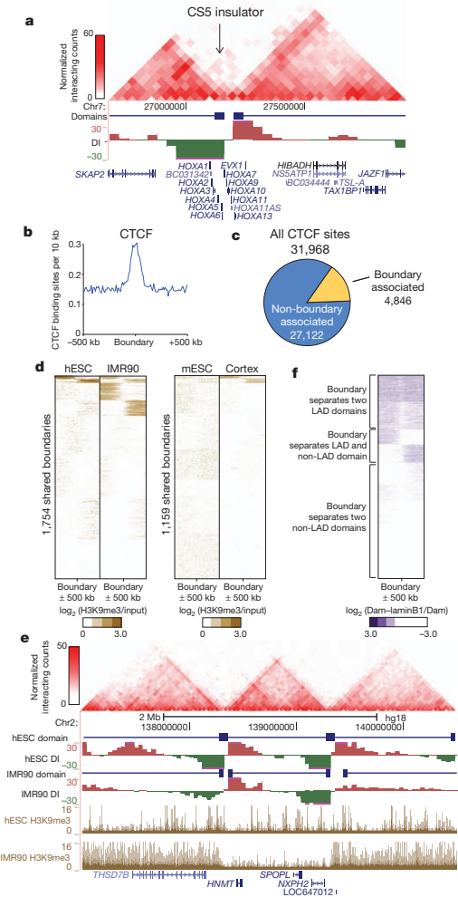
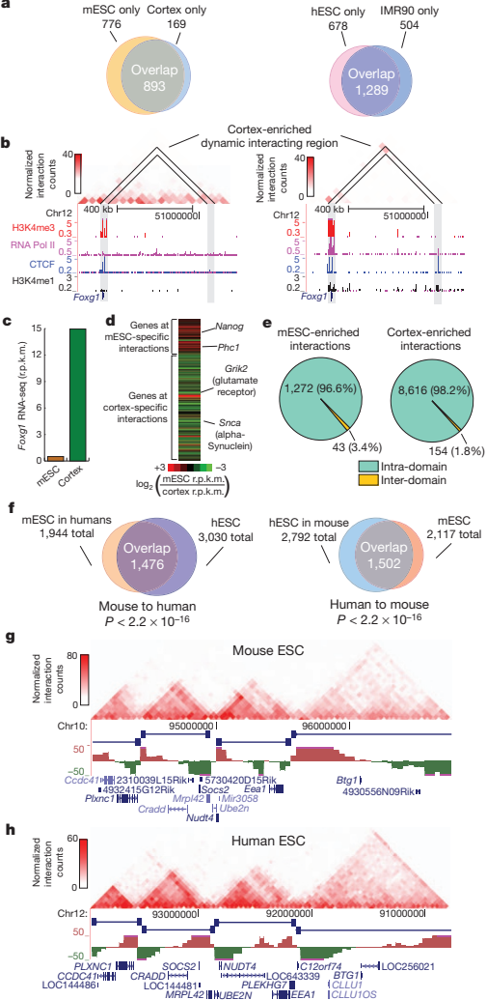
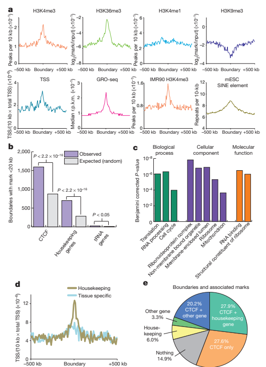

---
format:
  html:
    embed-resources: true
    include-in-header:
      text: |
        
    include-after-body:
      text: |
        
---

# Topological domains in mammalian genomes identified by analysis of chromatin interactions

Jesse R. Dixon 1,2,3, Siddarth Selvaraj1,4, Feng Yue 1, Audrey Kim 1, Yan Li 1, Yin Shen 1, Ming Hu 5, Jun S. Liu 5 & Bing Ren 1,6

1 Ludwig Institute for Cancer Research, 9500 Gilman Drive, La Jolla, California 92093, USA. 2 Medical Scientist Training Program, University of California, San Diego, La Jolla, California 92093, USA. 3 Biomedical Sciences Graduate Program, University of California, San Diego, La Jolla, California 92093, USA. 4 Bioinformatics and Systems Biology Graduate Program, University of California, San Diego, La Jolla, California 92093, USA. 5 Department of Statistics, Harvard University, 1 Oxford Street, Cambridge, Massachusetts 02138, USA. 6 University of California, San Diego School of Medicine, Department of Cellular and Molecular Medicine, Institute of Genomic Medicine, UCSD Moores Cancer Center, 9500 Gilman Drive, La Jolla, California 92093, USA.

The spatial organization of the genome is intimately linked to its biological function, yet our understanding of higher order genomic structure is coarse, fragmented and incomplete. In the nucleus of eukaryotic cells, interphase chromosomes occupy distinct chromosome territories, and numerous models have been proposed for how chromosomes fold within chromosome territories1. These models, however, provide only few mechanistic details about the relationship between higher order chromatin structure and genome function. Recent advances in genomic technologies have led to rapid advances in the study of three-dimensional genome organization. In particular, Hi-C has been introduced as a method for identifying higher order chromatin interactions genome wide2. Here we investigate the three-dimensional organization of the human and mouse genomes in embryonic stem cells and terminally differentiated cell types at unprecedented resolution. We identify large, megabase-sized local chromatin interaction domains, which we term ‘topological domains’, as a pervasive structural feature of the genome organization. These domains correlate with regions of the genome that constrain the spread of heterochromatin. The domains are stable across different cell types and highly conserved across species, indicating that topological domains are an inherent property of mammalian genomes. Finally, we find that the boundaries of topological domains are enriched for the insulator binding protein CTCF, housekeeping genes, transfer RNAs and short interspersed element (SINE) retrotransposons, indicating that these factors may have a role in establishing the topological domain structure of the genome.

&emsp;To study chromatin structure in mammalian cells, we determined genome-wide chromatin interaction frequencies by performing the Hi-C experiment2 in mouse embryonic stem (ES) cells, human ES cells, and human IMR90 fibroblasts. Together with Hi-C data for the mouse cortex generated in a separate study (Y. Shen et al., manuscript in preparation), we analysed over 1.7-billion read pairs of Hi-C data corresponding to pluripotent and differentiated cells (Supplementary Table 1). We normalized the Hi-C interactions for biases in the data (Supplementary Figs 1 and 2)3. To validate the quality of our Hi-C data, we compared the data with previous chromosome conformation capture (3C), chromosome conformation capture carbon copy (5C), and fluorescence in situ hybridization (FISH) results4–6. Our IMR90 Hi-C data show a high degree of similarity when compared to a previously generated 5C data set from lung fibroblasts (Supplementary Fig. 4). In addition, our mouse ES cell Hi-C data correctly recovered a previously described cell-type-specific interaction at the Phc1 gene 5 (Supplementary Fig. 5). Furthermore, the Hi-C interaction frequencies in mouse ES cells are well-correlated with the mean spatial distance separating six loci as measured by two-dimensional FISH6 (Supplementary Fig. 6), demonstrating that the normalized Hi-C data can accurately reproduce the expected nuclear distance using an independent method. These results demonstrate that our Hi-C data are of high quality and accurately capture the higher order chromatin structures in mammalian cells.

&emsp;We next visualized two-dimensional interaction matrices using a variety of bin sizes to identify interaction patterns revealed as a result of our high sequencing depth (Supplementary Fig. 7). We noticed that at bin sizes less than 100 kilobases (kb), highly self-interacting regions begin to emerge (Fig. 1a and Supplementary Fig. 7, seen as ‘triangles’ on the heat map). These regions, which we term topological domains, are bounded by narrow segments where the chromatin interactions appear to end abruptly. We hypothesized that these abrupt transitions may represent boundary regions in the genome that separate topological domains.

&emsp;To identify systematically all such topological domains in the genome, we devised a simple statistic termed the directionality index to quantify the degree of upstream or downstream interaction bias for a genomic region, which varies considerably at the periphery of the topological domains (Fig. 1b; see Supplementary Methods for details). The directionality index was reproducible (Supplementary Table 2) and pervasive, with 52% of the genome having a directionality index that was not expected by random chance (Fig. 1c, false discovery rate 5 1%). We then used a Hidden Markov model (HMM) based on the directionality index to identify biased ‘states’ and therefore infer the locations of topological domains in the genome (Fig. 1a; see Supplementary Methods for details). The domains defined by HMM were reproducible between replicates (Supplementary Fig. 8). Therefore, we combined the data from the HindIII replicates and identified 2,200 topological domains in mouse ES cells with a median size of 880 kb that occupy, 91% of the genome (Supplementary Fig. 9). As expected, the frequency of intra-domain interactions is higher than inter-domain interactions (Fig. 1d, e). Similarly, FISH probes6 in the same topological domain (Fig. 1f) are closer in nuclear space than probes in different topological domains (Fig. 1g), despite similar genomic distances between probe pairs (Fig. 1h, i). These findings are best explained by a model of the organization of genomic DNA into spatial modules linked by short chromatin segments. We define the genomic regions between topological domains as either ‘topological boundary regions’ or ‘unorganized chromatin’, depending on their sizes (Supplementary Fig. 9).

&emsp;We next investigated the relationship between the topological domains and the transcriptional control process. The Hoxa locus is separated into two compartments by an experimentally validated insulator4,7,8, which we observed corresponds to a topological domain boundary in both mouse (Fig. 1a) and human (Fig. 2a). Therefore, we hypothesized that the boundaries of the topological domains might correspond to insulator or barrier elements.

&emsp;Many known insulator or barrier elements are bound by the zinc-finger-containing protein CTCF (refs 9–11). We see a strong enrichment of CTCF at the topological boundary regions (Fig. 2b and Supplementary Fig. 10), indicating that topological boundary regions

::: {.fig-card}

**Figure 1.** Topological domains in the mouse ES cell genome. a, Normalized

Hi-C interaction frequencies displayed as a two-dimensional heat map overlayed on ChIP-seq data (from Y. Shen et al., manuscript in preparation), directionality index (DI), HMM bias state calls, and domains. For both directionality index and HMM state calls, downstream bias (red) and upstream bias (green) are indicated. b, Schematic illustrating topological domains and resulting directional bias. c, Distribution of the directionality index (absolute value, in blue) compared to random (red). d, Mean interaction frequencies at all genomic distances between 40 kb to 2 Mb. Above 40 kb, the intra- versus interdomain interaction frequencies are significantly different (P, 0.005,Wilcoxon test). e, Box plot of all interaction frequencies at 80-kb distance. Intra-domain interactions are enriched for high-frequency interactions. f–i, Diagram of intradomain (f) and inter-domain FISH probes (g) and the genomic distance between pairs (h). i, Bar chart of the squared inter-probe distance (from ref. 6) FISH probe pairs. mESC, mouse ES cell. Error bars indicate standard error ( n 5 100 for each probe pair).
:::

share this feature of classical insulators. A classical boundary element is also known to stop the spread of heterochromatin. Therefore, we examined the distribution of the heterochromatin mark H3K9me3 in humans and mice in relation to the topological domains12,13. Indeed, we observe a clear segregation of H3K9me3 at the boundary regions that occurs predominately in differentiated cells (Fig. 2d, e and Supplementary Fig. 11). As the boundaries that we analysed in

::: {.fig-card}

**Figure 2.** Topological boundaries demonstrate classical insulator or

barrier element features. a, Two-dimensional heat map surrounding the Hoxa locus and CS5 insulator in IMR90 cells. b, Enrichment of CTCF at boundary regions. c, The portion of CTCF binding sites that are considered ‘associated’ with a boundary (within 6 20-kb window is used as the expected uncertainty due to 40-kb binning). d, Heat maps of H3K9me3 at boundary sites in human and mouse. e, UCSC Genome Browser shot showing heterochromatin spreading in the human ES cells (hESC) and IMR90 cells. The two-dimensional heat map shows the interaction frequency in human ES cells. f, Heat map of LADs (from ref. 14) surrounding the boundary regions. Scale is the log2 ratio of DNA adenosine methylation (Dam)–lamin B1 fusion over Dam alone (Dam– laminB1/Dam).
:::

Fig. 2d are present in both pluripotent cells and their differentiated progeny, the topological domains and boundaries appear to pre-mark the end points of heterochromatic spreading. Therefore, the domains do not seem to be a consequence of the formation of heterochromatin. Taken together, the above observations strongly suggest that the topological domain boundaries correlate with regions of the genome displaying classical insulator and barrier element activity, thus revealing a potential link between the topological domains and transcriptional control in the mammalian genome.

&emsp;We compared the topological domains with previously described domain-like organizations of the genome, specifically with the A and B compartments described by ref. 2, with lamina-associated domains (LADs) 10,14, replication time zones15,16, and large organized chromatin K9 modification (LOCK) domains17. In all cases, we can see that topological domains are related to, but independent from, each of these previously described domain-like structures (Supplementary Figs 12– 15). Notably, a subset of the domain boundaries we identify appear to mark the transition between either LAD and non-LAD regions of the genome (Fig. 2f and Supplementary Fig. 12), the A and B compartments (Supplementary Fig. 13, 14), and early and late replicating chromatin (Supplementary Fig. 14). Lastly, we can also confirm the previously reported similarities between the A and B compartments and early and late replication time zone (Supplementary Fig. 16) 16.

&emsp;We next compared the locations of topological boundaries identified in both replicates of mouse ES cells and cortex, or between both replicates of human ES cells and IMR90 cells. In both human and mouse, most of the boundary regions are shared between cell types (Fig. 3a and Supplementary Fig. 17a), suggesting that the overall domain structure between cell types is largely unchanged. At the boundaries called in only one cell type, we noticed that trend of upstream and downstream bias in the directionality index is still readily apparent and highly reproducible between replicates (Supplementary Fig. 17b, c). We cannot determine if the differences in domain calls between cell types is due to noise in the data or to biological phenomena, such as a change in the strength of the boundary region between cell types 18. Regardless, these results indicate that the domain boundaries are largely invariant between cell types. Lastly, only a small fraction of the boundaries show clear differences between two cell types, suggesting that a relatively rare subset of boundaries may actually differ between cell types (Supplementary Fig. 18).

&emsp;The stability of the domains between cell types is surprising given previous evidence showing cell-type-specific chromatin interactions and conformations5,7. To reconcile these results, we identified cell-type-specific chromatin interactions between mouse ES cell and mouse cortex. We identified 9,888 dynamic interacting regions in the mouse genome based on 20-kb binning using a binomial test with an empirical false discovery rate of, 1% based on random permutation of the replicate data. These dynamic interacting regions are enriched for differentially expressed genes (Fig. 3b–d, Supplementary Fig. 19 and Supplementary Table 5). In fact, 20% of all genes that undergo a fourfold change in gene expression are found at dynamic interacting loci. This is probably an underestimate, because by binning the genome at 20 kb, any dynamic regulatory interaction less than 20 kb will be missed. Lastly,. 96% of dynamic interacting regions occur in the same domain (Fig. 3e). Therefore, we favour a model where the domain organization is stable between cell types, but the regions within each domain may be dynamic, potentially taking part in cell-type-specific regulatory events.

&emsp;The stability of the domains between cell types prompted us to investigate if the domain structure is also conserved across evolution. To address this, we compared the domain boundaries between mouse ES cells and human ES cells using the UCSC liftover tool. Most of the boundaries appear to be shared across evolution (53.8% of human boundaries are boundaries in mouse and 75.9% of mouse boundaries are boundaries in humans, compared to 21.0% and 29.0% at random, P value, 2.2 3 10 2 16, Fisher’s exact test; Fig. 3f). The syntenic regions in mouse and human in particular share a high degree of similarity in their higher order chromatin structure (Fig. 3g, h), indicating that there is conservation of genomic structure beyond the primary sequence of DNA.

&emsp;We explored what factors may contribute to the formation of topological boundary regions in the genome. Although most topological boundaries are enriched for the binding of CTCF, only 15% of CTCF

::: {.fig-card}

**Figure 3.** Boundaries are shared across cell types and conserved in

evolution. a, Overlap of boundaries between cell types. b, Genome browser shot of a cortex enriched dynamic interacting region that overlaps with the Foxg1 gene. c, Foxg1 expression in reads per kilobase per million reads sequenced (r.p.k.m.) in mouse ES cells and cortex as measured by RNA-seq. d, Heat map of the gene expression ratio between mouse ES cell and cortex of genes at dynamic interactions. e, Pie chart of inter- and intra-domain dynamic interactions. f, Overlap of boundaries between syntenic mouse and human sequences (P, 2.2 3 10 2 16 compared to random, Fisher’s exact test). g, h, Genome browser shots showing domain structure over a syntenic region in the mouse (g) and human (h) ES cells. Note: the region in humans has been inverted from its normal UCSC coordinates for proper display purposes.
:::

binding sites are located within boundary regions (Fig. 2c). Thus, CTCF binding alone is insufficient to demarcate domain boundaries. We reasoned that additional factors might be associated with topological boundary regions. By examining the enrichment of a variety of histone modifications, chromatin binding proteins and transcription factors around topological boundary regions in mouse ES cells, we observed that factors associated with active promoters and gene bodies are enriched at boundaries in both mouse and humans (Fig. 4a and Supplementary Figs 20–23) 19,20. In contrast, non-promoter-associated marks, such as H3K4me1 (associated with enhancers) and H3K9me3, were not enriched or were specifically depleted at boundary regions (Fig. 4a). Furthermore, transcription start sites (TSS) and global run on sequencing (GRO-seq)21 signal were also enriched around topological boundaries (Fig. 4a). We found that housekeeping genes were particularly strongly enriched near topological boundary regions (Fig. 4b–d; see Supplementary Table 7 for complete GO terms enrichment). Additionally, the tRNA genes, which have the potential to function as boundary elements22,23, are also enriched at boundaries (P value , 0.05, Fisher’s exact test; Fig. 4b). These results suggest that high levels of transcription activity may also contribute to boundary formation. In support of this, we can see examples of dynamic changes in H3K4me3 at or near some cell-type-specific boundaries that are cell-type specific (Supplementary Fig. 24). Indeed, boundaries associated with both CTCF and a housekeeping gene account for nearly one-third of all topological boundaries in the genome (Fig. 4e and Supplementary Fig. 24).

::: {.fig-card}

**Figure 4.** Boundary regions are enriched for housekeeping genes.

a, Chromatin modifications, TSS, GRO-seq and SINE elements surrounding boundary regions in mouse ES cells or IMR90 cells. b, Boundaries associated with a CTCF binding site, housekeeping gene, or tRNA gene (purple) compared to expected at random (grey). c, Gene Ontology P-value chart. d, Enrichment of housekeeping genes (gold) and tissue-specific genes (blue) as defined by Shannon entropy scores near boundaries normalized for the number of genes in each class (TSS/10 kb/total TSS). e, Percentage of boundaries with a given mark within 20 kb of the boundaries.
:::

&emsp;Finally, we analysed the enrichment of repeat classes around boundary elements. We observed that Alu/B1 and B2 SINE retrotransposons in mouse and Alu SINE elements in humans are enriched at boundary regions (Fig. 4a and Supplementary Figs 24 and 25). In light of recent reports indicating that a SINE B2 element functions as a boundary in mice24, and SINE element retrotransposition may alter CTCF binding sites during evolution25, we believe that this contributes to a growing body of evidence indicating a role for SINE elements in the organization of the genome.

&emsp;In summary, we show that the mammalian chromosomes are segmented into megabase-sized topological domains, consistent with some previous models of the higher order chromatin structure1,26,27. Such spatial organization seems to be a general property of the genome: it is pervasive throughout the genome, stable across different cell types and highly conserved between mice and humans.

&emsp;We have identified multiple factors that are associated with the boundary regions separating topological domains, including the insulator binding factor CTCF, housekeeping genes and SINE elements. The association of housekeeping genes with boundary regions extends previous studies in yeast and insects and suggests that non-CTCF factors may also be involved in insulator/barrier functions in mammalian cells28.

&emsp;The topological domains we identified are well conserved between mice and humans. This indicates that the sequence elements and mechanisms that are responsible for establishing higher order structures in the genome may be relatively ancient in evolution. A similar partitioning of the genome into physical domains has also been observed in Drosophila embryos29 and in high-resolution studies of the X-inactivation centre in mice (termed topologically associated domains or TADs)30, indicating that topological domains may be a fundamental organizing principle of metazoan genomes.

METHODS SUMMARY

Cell culture and Hi-C experiments. J1 mouse ES cells were grown on gammairradiated mouse embryonic fibroblasts cells under standard conditions (85% high glucose DMEM, 15% HyClone FBS, 0.1 mM non-essential amino acids, 0.1 mM b-mercaptoethanol, 1 mM glutamine, LIF 500 U ml2 1, 1 3 Gibco penicillin/ streptomycin). Before collecting for Hi-C, J1 mouse ES cells were passaged onto feeder free 0.2% gelatin-coated plates for at least two passages to rid the culture of feeder cells. H1 human ES cells and IMR90 fibroblasts were grown as previously described13. Collecting the cells for Hi-C was performed as previously described, with the only modification being that the adherent cell cultures were dissociated with trypsin before fixation. Sequencing and mapping of data. Hi-C analysis and paired-end libraries were prepared as previously described2 and sequenced on the Illumina Hi-Seq2000 platform. Reads were mapped to reference human (hg18) or mouse genomes (mm9), and non-mapping reads and PCR duplicates were removed. Twodimensional heat maps were generated as previously described2. Data analysis. For detailed descriptions of the data analysis, including descriptions of the directionality index, hidden Markov models, dynamic interactions identification, and boundary overlap between cells and across species, see Supplementary Methods.

1. Cremer, T. & Cremer, M. Chromosome territories. Cold Spring Harb. Perspect. Biol.

&emsp;2, a003889 (2010). 2. Lieberman-Aiden, E. et al. Comprehensive mapping of long-range interactions

&emsp;reveals folding principles of the human genome. Science 326, 289–293 (2009).

Supplementary Information is linked to the online version of the paper at www.nature.com/nature.
